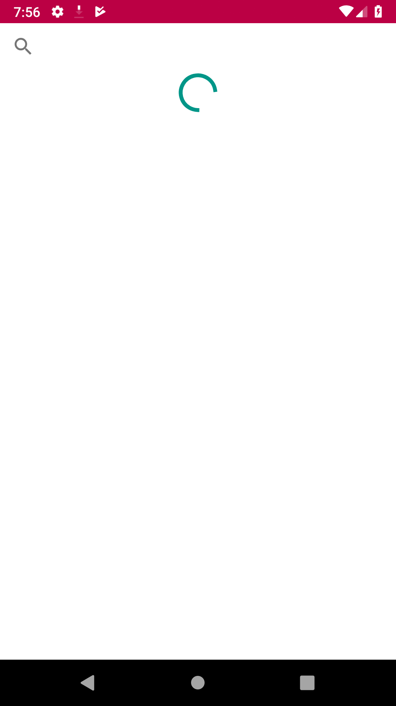
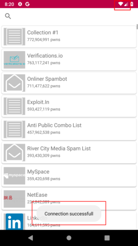
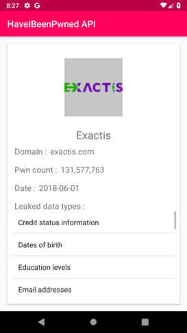
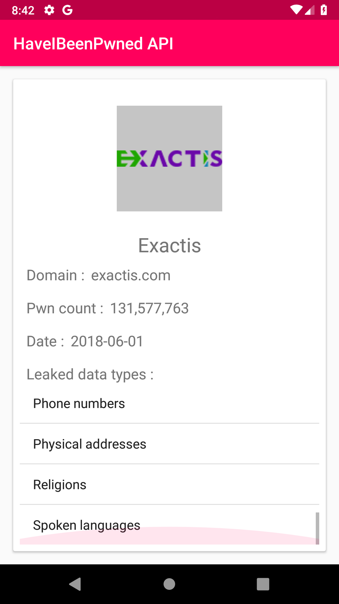

# Android-HaveIBeenPwned-API
Just an Android interface to the Have I Been Pwned API

## Presentation
Une application toute simple utilisant l'API de site Have I Been Pwned afin d'afficher la liste des differents leaks ayants ete referance.

## Fonctionnalites
### Ecran principal :
- Affiche la liste des leaks sous forme de cartes les unes a la suite des autres
- Affiche une barre de chargement le temps que la requete s'effectue

- Utilisation d'une barre de recherche permettant de filtrer les leaks par titre ou nom de domaine.

- Utilisation du cache permettant de stocker la liste des leaks, permettant de l'afficher meme sans connexion (L'application affiche un toast afin de savoir si l'application a reussit a requeter l'API ou non)
 

### Ecran secondaire
- Affichage global toujour sous forme de carte
- Affichage du logo, titre, nom de domaine, nombre de données leakés, date du leak et les types de données.
  - Les types de données sont affichés via une ListView afin de pouvoir scroller si il y en a trop pour etre afficher a l'ecran
 
