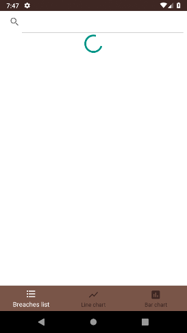

# Android-HaveIBeenPwned-API
Just an Android interface to the Have I Been Pwned API

## Presentation
Une application toute simple utilisant l'API de site Have I Been Pwned afin d'afficher la liste des differents leaks ayants été référancé.

## Consignes
- Le minimum :
  - Deux écrans : Un écran avec une liste et un écran avec un détail de l’item (Fait)
  - Appel WebService à une API Rest (Fait)
  - Stockage des données en cache (Fait)
- Les plus :
  - Architecture (MVC ou MVP ou MVVM) (Fait)
  - Gitflow (Fait)
  - Animation entre écrans
  - Notifications Push (Firebase)
  - Autres fonctionnalités (Fait : barre de recherche + toasts)

## Fonctionnalites
### Ecran principal :
- Affichage de la liste des leaks sous forme de cartes les unes a la suite des autres
- Affichage d'une barre de chargement le temps que la requete s'effectue

- Utilisation d'une barre de recherche permettant de filtrer les leaks par titre ou nom de domaine.

- Utilisation du cache permettant de stocker la liste des leaks, afin de les afficher meme sans connexion (L'application affiche un toast pour savoir si l'application a reussit a requeter l'API ou non)

 

### Ecran secondaire
- Affichage global toujours sous forme d'une carte
- Affichage du logo, titre, nom de domaine, nombre de données leakés, date du leak et les types de données.
  - Les types de données sont affichés via une ListView afin de pouvoir scroller s'il y en a trop pour etre affiché a l'écran
  
 
