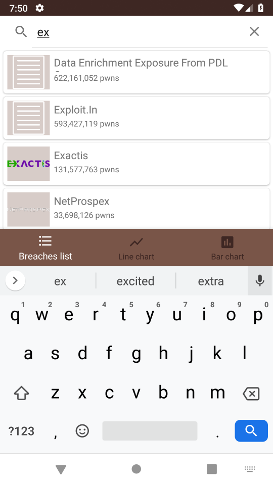
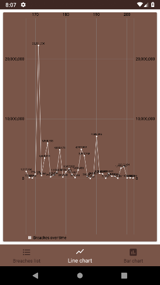
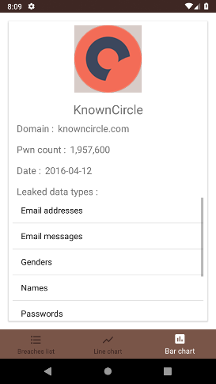

# Android-HaveIBeenPwned-API
Just an Android interface to the Have I Been Pwned API

## Presentation
Une application toute simple utilisant l'API de site Have I Been Pwned afin d'afficher la liste des differents leaks ayants été référancés sous forme de liste triée par nombre d'elements ou sous forme de graphique linéaire ou de graphique avec barres triées par dates.
je me suis servis de mon application réalisé durant le cours de l'année derniére afin d'y ajouter les nouvelles fonctionnalités requises. J'en ais également profité pour changer le théme de l'application (Ce qui explique le changement de couleurs et la disparition de la barre de navigation sur certaines screenshots).

## Consignes
- Fragments (Fait)
- Appel WebService à une API Rest (Fait)
- Design (Fait)
- Architecture MVC (Fait)
- Git (Fait)

## Fonctionnalites
- Utilisation d'une BottomNavigationBar pour naviguer entre les differents fragments
- Affichage d'une barre de chargement sur chaque fragment le temps que la requete API s'effectue

- Affichage de la liste des leaks sous forme de cartes les unes a la suite des autres
- Utilisation d'une barre de recherche permettant de filtrer les leaks par titre ou nom de domaine.

- Utilisation du cache permettant de stocker la liste des leaks, afin de les afficher meme sans connexion (L'application affiche un toast pour prévenir si l'application n'a pas reussit a requeter l'API)

 

- Affichage d'une carte contenant les informations detaillées d'un element de la liste lorsque que l'on clic sur un.
  - Affichage du logo, titre, nom de domaine, nombre de données leakés, date du leak et les types de données.
  - Les types de données sont affichés via une ListView afin de pouvoir scroller s'il y en a trop pour etre affiché a l'écran
  
 

- Le deuxiéme et le troisiéme menu de la barre de navigation sont respectivement un diagramme linéaire et un diagramme a barres.
- Il affichent tous les deux la liste des breachs en fonction de leur date du leak en X et leur nombre de données leaké en Y.
- Il est possible de zoomer sur les deux diagrammes.

 

- Sur les deux diagrammes il est possible de séléctionner un élément afin d'afficher son titre et sa date.

- Il est egaement possible de faire apparaitre le fragment de vue detaillé d'une breach en appuyant une deuxiéme fois dessus aprés avoir séléctionné un élément

